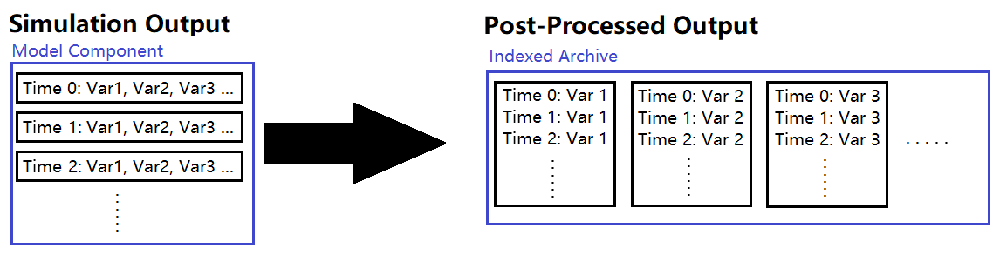

# Persad CESM2 Postprocessing Scripts

`\first_batch`, `\second_batch`, and `\third_batch` contain bash scripts for pulling variables out of the simulation outputs and concatenating the time series.

Running these jobs worked for most variables, but not all of them.

`\fix_missing_atm`, `\fix_missing_ocn`, `\fix_missing_5ocn` processes the variables missed in the original batch jobs.

`\archiving` and `\archiving_pt2` contain bash scripts for archiving the post-processed netCDF files into .tar files to store on Ranch. Variables are archived into .tar files and then archived in groups to target the ideal file size for long term storage on Ranch.

`\validation` contains a script that counts the number of netCDF files outputted by the batch jobs.

`\transfer` contains a script that transfers the archives from lonestar6

`check_integrity.sh` checks the integrity of the .tar archives by opening them and attempting to search the contents

`find_archives.sh` is for use on Ranch and allows the user to search the archive files for specific variables.

## Simulation Output to Post-Processed Data

